

<h1 align="center">Hola, soy <a href="https://github.com/Rubik3x3">Franco</a></h1>

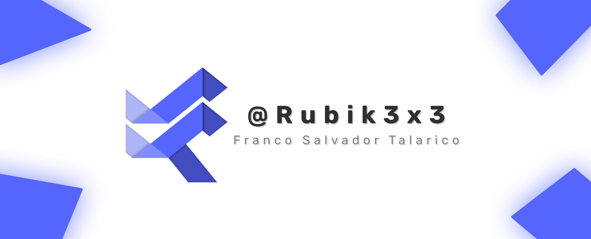
<!-- 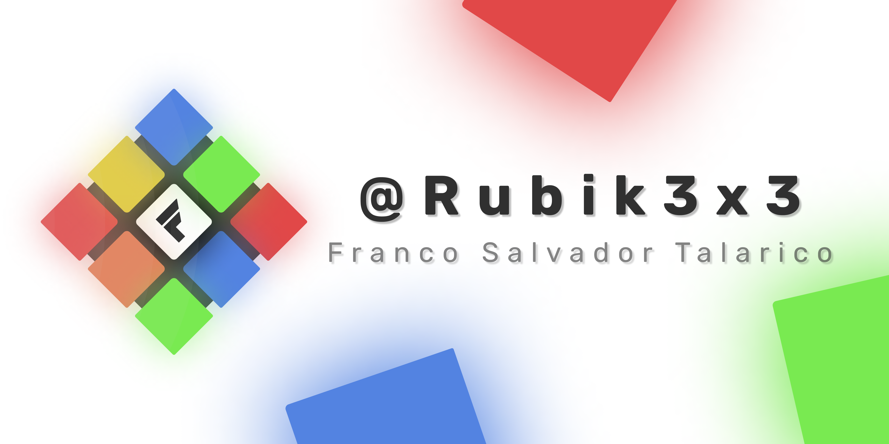 -->

<!-- ## Technologies: -->
<!-- 

 

 --> 
<!--

<!--
## Programs:

 

 
-->
<!--
## IDEs:

 

 

 
-->
## Aplicaciones y Juegos
<table>
<tr>
  
<td width="50%">
<h3 align="center">Resistor Color Code Calculator</h3>

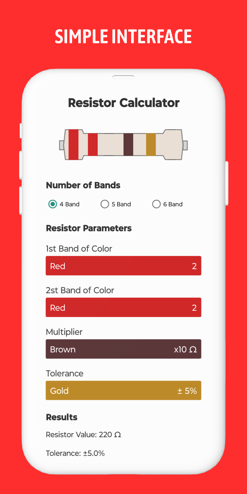
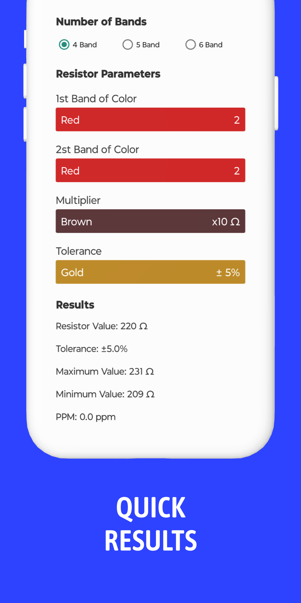
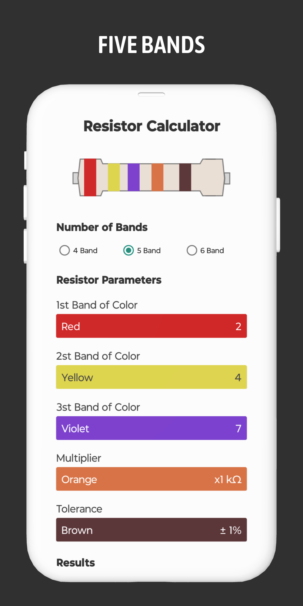
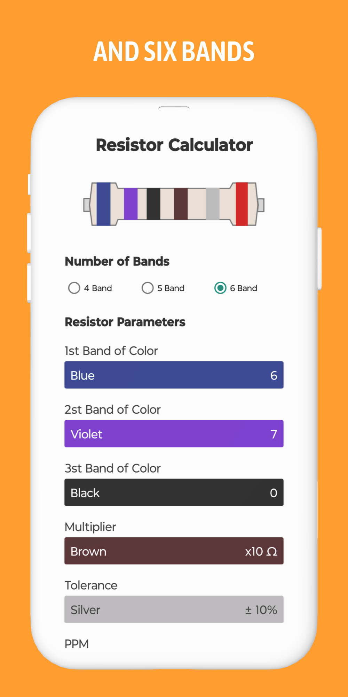

 

Una aplicación que calcula el valor de los resistores en base al código de colores de las bandas.

</td>
<td width="50%">
<h3 align="center">Eclipse: Reaction Game</h3>

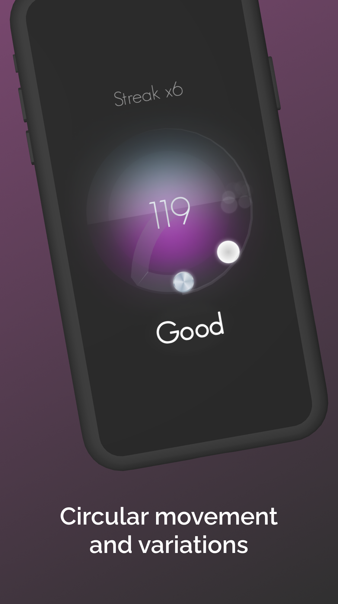
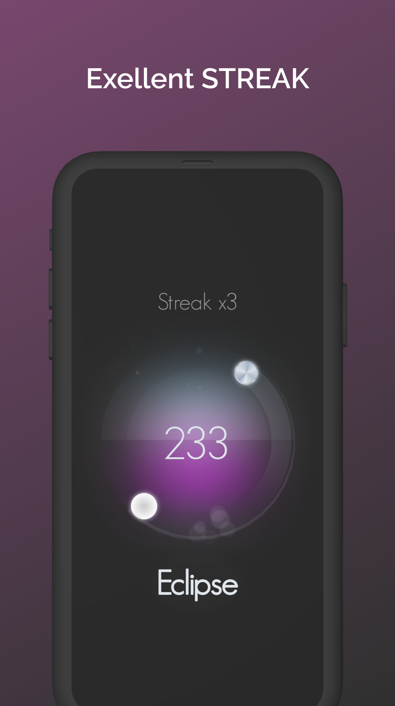
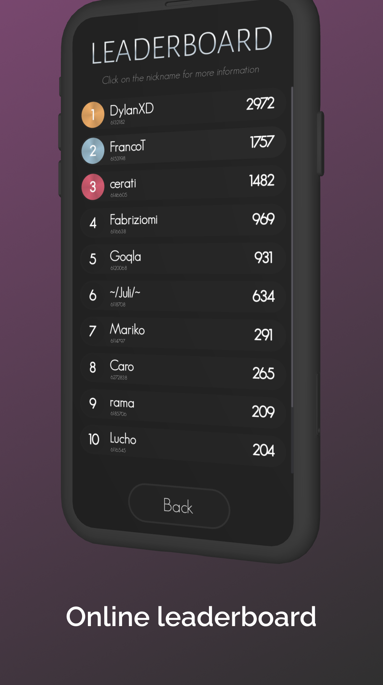
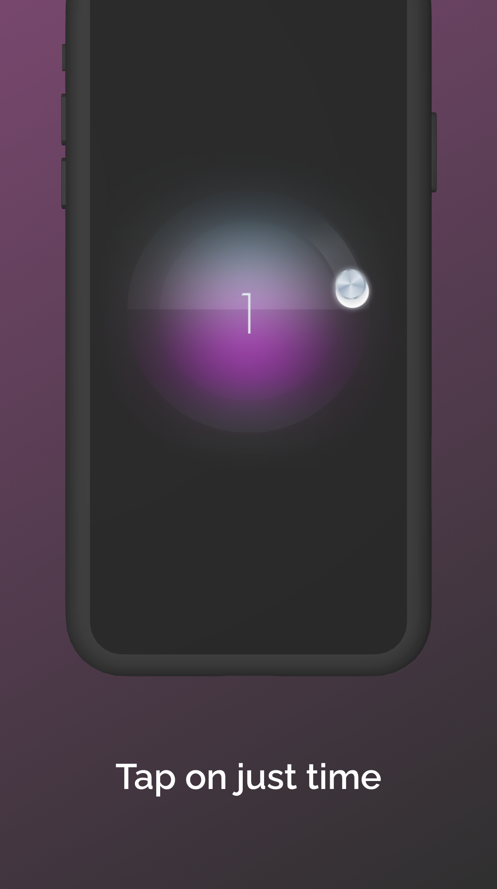

 

Juego de reacción que te desafía a reaccionar rápidamente a la superposición de cuerpos circulares en movimiento.

</td>

</tr>
</table>

 

## Videos de Youtube
<table>
<tr>
  
<td width="50%">
<h3 align="center">Demostración Visual de la Serie Geometrica 1/2^n</h3>

<a href="https://www.youtube.com/watch?v=Jlk-QHUI64A" target="_blank">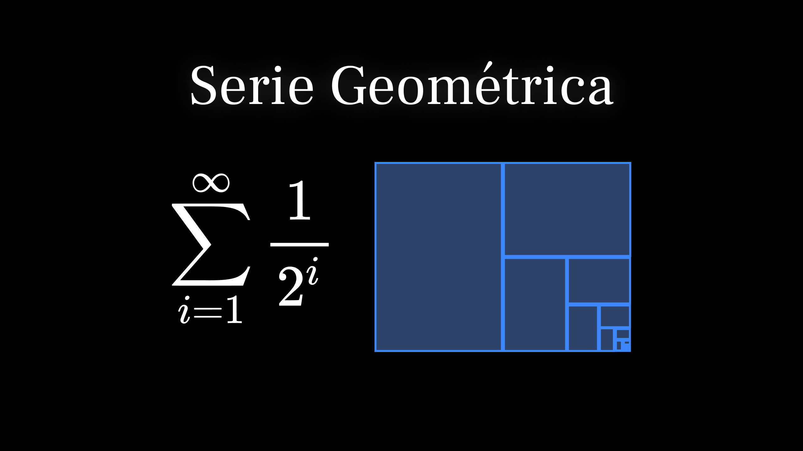</a>

 

En este video se realiza una demostración visual de la serie geométrica 1/2^n, explicando sus propiedades y convergencia. 

</td>
<td width="50%">
<h3 align="center">Demostración Visual del Área de un Círculo</h3>

<a href="https://www.youtube.com/watch?v=-1JQEb1NnUY" target="_blank">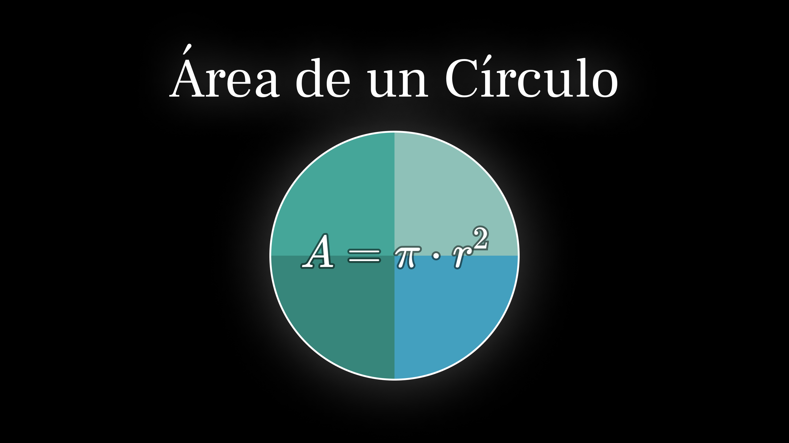</a>

 

En este video se realiza una demostración visual de por qué el Área de un Círculo es π.r²

</td>

</tr>
</table>

<h2 align="center">GitHub Stats</h2>

  

    
    
  

  

    
  

  

    
  

<!--
<h2 align="center">APPs, Games and Youtube</h2>

  
  
  

-->
<h2 align="center">Contacto</h2>

  

<!--
**Rubik3x3/Rubik3x3** is a ✨ _special_ ✨ repository because its `README.md` (this file) appears on your GitHub profile.
Here are some ideas to get you started:
- 🔭 I’m currently working on ...
- 🌱 I’m currently learning ...
- 👯 I’m looking to collaborate on ...
- 🤔 I’m looking for help with ...
- 💬 Ask me about ...
- 📫 How to reach me: ...
- 😄 Pronouns: ...
- ⚡ Fun fact: ...
-->
