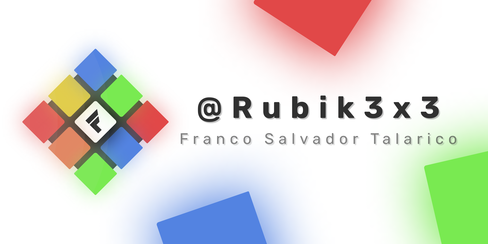

<h1 align="center">Hi, I'm <a href="https://github.com/Rubik3x3">Franco</a></h1>

<!--  -->

<!-- ## Technologies: -->

 

 

 

<!--
## Programs:

 

 
-->
<!--
## IDEs:

 

 

 
-->

<h2 align="center">GitHub Stats</h2>
  

  

    
    
  

  

    
  

  

    
  

<h2 align="center">APPs and Games</h2>

 

<h2 align="center">Contact me</h2>

 

<!--
**Rubik3x3/Rubik3x3** is a ✨ _special_ ✨ repository because its `README.md` (this file) appears on your GitHub profile.
Here are some ideas to get you started:
- 🔭 I’m currently working on ...
- 🌱 I’m currently learning ...
- 👯 I’m looking to collaborate on ...
- 🤔 I’m looking for help with ...
- 💬 Ask me about ...
- 📫 How to reach me: ...
- 😄 Pronouns: ...
- ⚡ Fun fact: ...
-->
